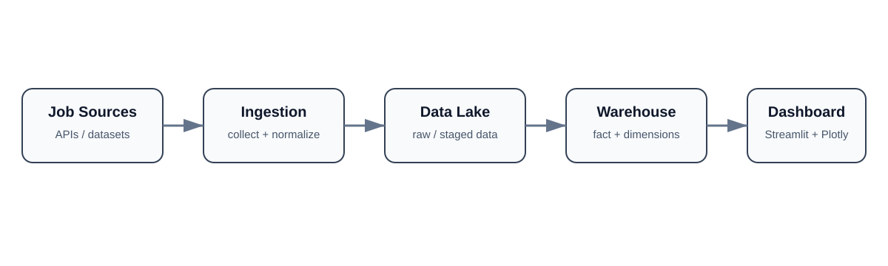

# Job Intelligent

**Job-market intelligence pipeline and analytics dashboard.**

Job Intelligent collects and structures job-market data, transforms it into an analytics-ready warehouse, and exposes hiring trends through an interactive Streamlit dashboard. The project focuses on data engineering, dimensional modelling, market analysis, and clear visualization rather than making unsupported hiring predictions.

## Architecture



The pipeline is intentionally separated into ingestion, storage, transformation, and presentation layers so each stage can be inspected or extended independently.

## What the project does

- organizes job data from configured sources;
- stages collected records in a data-lake structure;
- transforms data into a dimensional warehouse;
- models jobs, companies, locations, and skills separately;
- links jobs to extracted skills through a bridge table;
- provides filters for title, location, employment type, and skill;
- visualizes the most requested skills and strongest hiring locations;
- exposes headline metrics for jobs, companies, locations, and detected skills.

## Analytics model

The dashboard reads the warehouse outputs:

```text
fact_jobs.csv
  ├── dim_company.csv
  ├── dim_location.csv
  └── bridge_job_skills.csv ──> dim_skills.csv
```

This structure keeps descriptive entities separate from the job fact table and makes skill analysis easier to extend.

## Technology stack

- Python
- Pandas
- Streamlit
- Plotly
- Requests
- python-dotenv

## Repository structure

```text
.
├── dashboard/          # Streamlit analytics application
├── ingestion/          # collection configuration and ingestion scripts
├── data_lake/          # raw/staged data area
├── warehouse/          # transformed fact and dimension outputs
├── sources/            # source-specific components
├── docs/               # project documentation and architecture diagram
├── requirements.txt
└── .env.example
```

## Run locally

```bash
python -m venv .venv
```

Activate the environment, then install dependencies:

```bash
pip install -r requirements.txt
```

If a source requires configuration, copy the example environment file and fill only the required local values:

```bash
cp .env.example .env
```

Run the data preparation/ingestion workflow required by the source configuration, then launch the dashboard:

```bash
streamlit run dashboard/app.py
```

The dashboard expects the analytics-ready CSV files under `warehouse/output/`.

## Dashboard capabilities

The current interface supports:

- job-title search;
- multi-select location filtering;
- employment-type filtering;
- skill filtering;
- available-job count;
- distinct-company and location counts;
- detected-skill count;
- most-requested-skill ranking;
- top-location analysis.

## Engineering focus

This repository demonstrates an end-to-end analytical data flow rather than a single notebook: source data is separated from ingestion logic, warehouse outputs are explicitly modelled, and the dashboard consumes those outputs as a presentation layer.

## Limitations

- results reflect the data currently collected by the configured sources and are not a complete census of the job market;
- job postings can be duplicated, outdated, or incomplete depending on the upstream source;
- skill extraction and normalization should be validated before using the project for high-stakes labour-market conclusions;
- credentials and private API tokens must stay in local environment variables and must never be committed.

## Author

Developed and maintained by **Chaima Menouar** as a data-engineering and analytics portfolio project.
