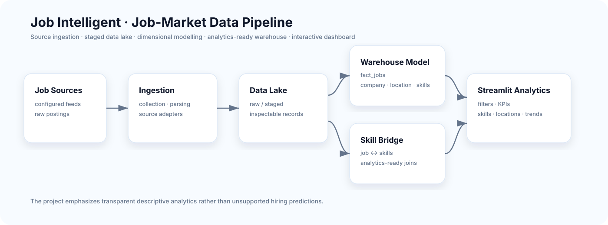

<div align="center">

# Job Intelligent

### Job-market data engineering & analytics pipeline

**Ingestion · data lake · dimensional warehouse · skills analytics · Streamlit dashboard**


</div>

Job Intelligent collects and structures job-market data, transforms it into an analytics-ready dimensional model and exposes hiring trends through an interactive Streamlit dashboard.

The project focuses on **data engineering, dimensional modelling and transparent descriptive analytics** rather than unsupported hiring predictions.

## Architecture



## What the project does

- organizes job data from configured sources;
- stages collected records in a data-lake structure;
- transforms data into a dimensional warehouse;
- models jobs, companies, locations and skills separately;
- links jobs to extracted skills through a bridge table;
- supports filters for title, location, employment type and skill;
- visualizes requested skills and hiring locations;
- exposes headline metrics for jobs, companies, locations and skills.

## Analytics model

```text
fact_jobs.csv
  ├── dim_company.csv
  ├── dim_location.csv
  └── bridge_job_skills.csv ──> dim_skills.csv
```

This structure separates descriptive entities from the job fact table and keeps skills analysis extensible.

## Dashboard experience

- job-title search;
- multi-select location filtering;
- employment-type filtering;
- skill filtering;
- available-job count;
- distinct-company/location counts;
- detected-skill count;
- most-requested-skill ranking;
- top-location analysis.

## Technology stack

`Python` · `Pandas` · `Streamlit` · `Plotly` · `Requests` · `python-dotenv`

## Repository structure

```text
.
├── dashboard/          Streamlit analytics application
├── ingestion/          source configuration + ingestion scripts
├── data_lake/          raw / staged data area
├── warehouse/          fact + dimension outputs
├── sources/            source-specific adapters
├── docs/               architecture and documentation
├── requirements.txt
└── .env.example
```

## Run locally

```bash
python -m venv .venv
pip install -r requirements.txt
cp .env.example .env
streamlit run dashboard/app.py
```

The dashboard expects analytics-ready CSV files under `warehouse/output/`.

## Engineering focus

This repository demonstrates an **end-to-end analytical data flow rather than a single notebook**: source data is separated from ingestion logic, warehouse outputs are explicitly modelled and the dashboard consumes those outputs as a presentation layer.

## Limitations

- results reflect configured data sources, not the complete job market;
- upstream postings may be duplicated, outdated or incomplete;
- skill extraction/normalization should be validated before high-stakes labour-market conclusions;
- credentials and private API tokens must remain in environment variables.

## Author

Developed and maintained by **Chaima Menouar** as a data-engineering and analytics portfolio project.
